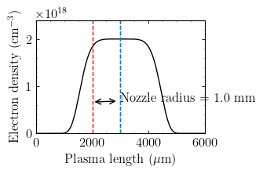

# prepic-density
Pre-pic and plot density profile of a gas jet

To run, `python prepic_density.py`. To generate the corresponding `jupyter notebook`, we use
[`jupytext`](https://github.com/mwouts/jupytext). 

To generate a jupyter notebook from a Python script, do:

```console
jupytext prepic_density.py --to ipynb
```

One then has to delete the original Python script, which will be re-generated by Jupyter.

To install pre-pic: https://prepic.readthedocs.io/en/latest/readme.html

For `LaTeX` font rendering of `matplotlib` figures, under `Ubuntu 20.04`:

```console
$ sudo apt install dvipng texlive-latex-extra texlive-fonts-recommended cm-super
```



```
beam with w0=18.7 µm (FWHM=22.0 µm), zᵣ=1.37 mm, λL=0.80 µm
laser with kL=7.854 1/µm, ωL=2.355 1/fs, ɛL=1.8 J, τL=25.0 fs, P₀=67.6 TW
I₀=1.2e+19 W/cm**2, a₀=2.4, E₀=9.6e+03 MV/mm
Helium ionization state: 2+
critical density for this laser is 1.7e+21 cm**(-3)
Plasma with nₚ=5.3e+18 cm**(-3) (3.05e-03 × nc), ωₚ=0.130 1/fs, kₚ=0.434 1/µm, λₚ=14.5 µm, Ewb=221.5 MV/mm
Pc=5.6 TW, Ldeph=1.56 mm, Ldepl=2.46 mm, ΔE=171.6 MeV over Lacc=1.00 mm
3D simulation with box size (97.0 µm)³, Δx=0.231 µm, Δy=0.231 µm, Δz=0.040 µm, nx=420, ny=420, nz=2425, 8.555400e+08 macro-particles, 2.742400e+04 time steps
```
